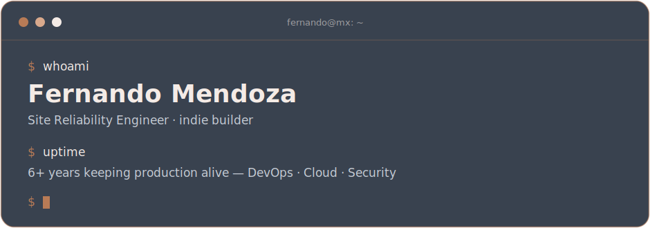

 

&nbsp;

&nbsp;

## $ whoami

Hey, I'm **Fernando** — a Site Reliability Engineer from México with **6+ years** in the tech
industry. My day job is keeping production healthy: DevOps and CI/CD, cloud architecture,
high-scale systems, and the security side of the house — DFIR included — when things get
interesting.

Off the clock I run a one-person product studio. I founded **[Agentyk](https://agentyk.co)**, an
AI consulting practice for companies in México and LATAM, and I ship my own products end to
end: web, mobile, health-tech, and payment experiments on-chain.

I work with AI agents in the loop every day — they handle the heavy lifting while I make the
calls. Most of that shipping happens in private repos, so don't let the quiet contribution
graph fool you.

## $ ls ~/stack

**apps/**

**infra/**

## $ ls ~/projects

| | |
|---|---|
| **[Agentyk](https://agentyk.co)** | AI consulting studio for México & LATAM — from strategy to shipped systems. |
| **[The Mural](https://themural.online)** | A collaborative mural that lives on-chain — claim a line, leave your mark. |
| **Stealth mode** | A clinic platform, combat-sports apps, payment rails — brewing in private repos. |

 

  <code>$ exit 0</code> — built by a human, shipped with agents.

